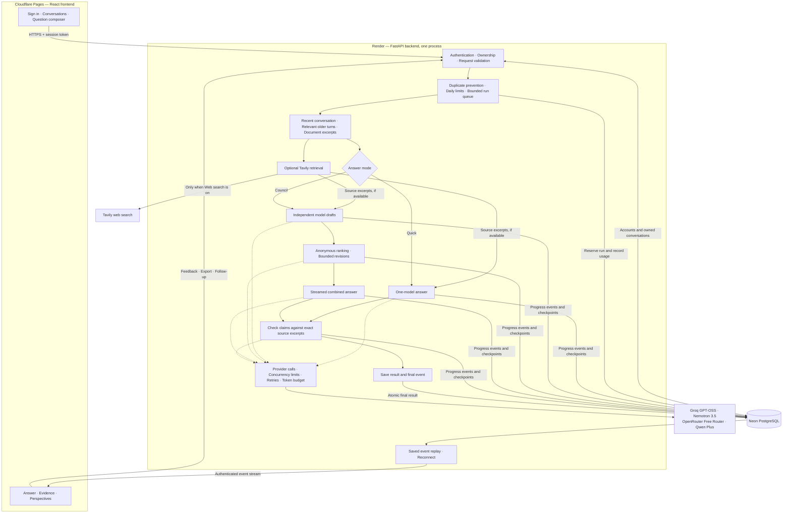

# Convene

Convene is a private workspace for comparing answers from multiple language models. Ask a question, review independent perspectives, and read a combined answer with source evidence where available.

**Stack:** React · TypeScript · FastAPI · PostgreSQL

**Hosting:** Cloudflare Pages · Render · Neon

Answers support Markdown, mathematics, and Mermaid diagrams. The renderer recognizes Mermaid declarations in mislabeled code fences and retries invalid flowcharts with quoted rectangular labels. Incomplete or unsupported diagrams retain their source without displaying repeated error banners.

Administrators can enable a private dashboard for signups, active users, run outcomes, and recorded usage. Access is restricted on the backend to configured account IDs; see [admin setup](docs/deployment.md#private-admin-dashboard).

## Architecture



The diagram describes the implemented application. The router uses simple rules; it is not a trained routing model. All provider requests pass through the shared gateway.

### Answer lifecycle

1. **Authenticate and reserve.** The API checks conversation ownership, validates input, applies daily limits, and prevents duplicate submissions. Each conversation has at most one active answer.
2. **Build context.** The backend selects recent turns, relevant older messages, and excerpts from uploaded documents. Follow-up questions can reuse documents from the conversation.
3. **Choose depth.** Quick uses one model. Council asks independent models, compares anonymous drafts, and allows up to three review rounds. Auto selects between these approaches using question length, task keywords, and document presence.
4. **Retrieve sources when requested.** Web search runs only when enabled. Search failures remain visible; they do not become invented sources.
5. **Generate and compare.** Models produce independent drafts. Duplicate underlying models are excluded from voting. Valid reviews can trigger revisions before synthesis.
6. **Check evidence.** Important claims are assessed against supplied source excerpts. An excerpt must exist in its cited source. Claims without sufficient evidence remain unknown.
7. **Save and deliver.** Ordered events let the browser reconnect without losing saved output. Completion saves the result and releases the conversation. Users can export answers or give feedback.

Model agreement indicates agreement between reviewers, **not proof that an answer is correct**. Evidence assessments are also model judgments and should be checked for important decisions.

### Implementation map

| Responsibility | Code |
| --- | --- |
| Account access and API routes | [backend/api](backend/api) |
| Routing, context, review, evidence, run lifecycle | [backend/core](backend/core) |
| Model catalog and environment settings | [backend/config.py](backend/config.py) |
| Provider requests, limits, fallback, usage | [backend/llm/gateway.py](backend/llm/gateway.py) |
| Transactions, conversation ownership, durable events | [backend/storage/database.py](backend/storage/database.py) |
| Document extraction and token estimation | [backend/utils](backend/utils) |
| Workspace, settings, answers, evidence views | [frontend/src/components](frontend/src/components) |
| Browser API access and event reconnection | [frontend/src/lib](frontend/src/lib) |

## Models and API keys

| Model | Provider key | Notes |
| --- | --- | --- |
| GPT-OSS 120B | GROQ_API_KEY | Explicit model: openai/gpt-oss-120b |
| Nemotron 3.5 Lightning | OPENROUTER_API_KEY | nvidia/nemotron-3.5-lightning:free |
| OpenRouter Free Router | OPENROUTER_API_KEY | openrouter/free; the underlying model can vary |
| Qwen Plus | QWEN_API_KEY | qwen-plus on the QwenCloud international endpoint |
| Web search | TAVILY_API_KEY | Optional; retrieves sources rather than generating answers |

The full council uses **three LLM API keys**. Tavily adds a fourth key for search. Models without configured credentials are unavailable in settings. Free endpoints have provider quotas; Qwen usage depends on the account's credits or billing.

QwenCloud's documented base URL is `https://dashscope-intl.aliyuncs.com/compatible-mode/v1`. A key created for a different Alibaba region needs that region's endpoint. See [QwenCloud's API reference](https://docs.qwencloud.com/api-reference/chat/openai-chat).

OpenRouter's free router chooses its own underlying model. Removing a direct model entry from Convene does not control which model the router selects.

To run small live checks without printing secrets:

```bash
.venv/bin/python -m scripts.check_providers
# Check only one provider:
.venv/bin/python -m scripts.check_providers --provider qwen
```

These checks make real API calls and consume provider quota. A 401 means credentials were rejected at that endpoint; a 429 indicates a limit, not a confirmed invalid key.

## When to use Tavily

Web search is **off by default** and works with Quick, Council, or Auto.

| Turn it on for | Leave it off for |
| --- | --- |
| Current events, release changes, recent prices, or changing facts | Rewriting, brainstorming, and questions about text you provide |
| Research that needs external citations | Stable explanations or calculations that do not need current sources |
| Comparing claims against public sources | Private document questions that should not be sent to a search service |

When enabled, the backend sends up to the first 500 characters of the **current question** to Tavily. It does not send the attached documents or conversation history to the search API. Do not put private information in a question with Web search enabled.

Each run makes at most one basic search, retrieves up to four sources, and can reuse a matching result for five minutes. Retrieved snippets support the evidence view; the app does not claim to have read every source page in full. Document evidence works without Tavily. Missing search credentials or search failures leave the answer with an explicit evidence gap.

## Run locally

Use **Python 3.12+** and **Node.js 22.12+**.

### Backend

From the repository root:

```bash
# Create a template only if you do not already have .env.
test -f .env || cp .env.example .env
python3 -m venv .venv
.venv/bin/python -m pip install -e '.[dev]'
# Edit .env locally and add your keys. Preserve your existing Neon connection string.
.venv/bin/python -m scripts.init_db
.venv/bin/python -m uvicorn backend.main:app --reload --port 8001
```

Local development can use the SQLite default in .env.example. If DATABASE_URL contains your Neon URL, local runs use that Neon database. Use APP_ENV=development and the localhost CORS origins while testing locally.

### Frontend

In another terminal:

```bash
cd frontend
npm ci
npm run dev
```

Open **http://localhost:5173**, create an account, and ask a short question. The development server forwards /api requests to port 8001. API documentation is available at http://localhost:8001/docs in development.

### Local acceptance check

- Ask a Quick question with Web search off, then a Council question.
- Open Perspectives and Evidence; confirm missing evidence is shown honestly.
- Enable Web search for a current-information question.
- Attach a document, ask about it, and send a follow-up.
- Reload, reopen the conversation, export it, and test cancellation.
- Sign out and confirm the workspace requires sign-in.

Uploads support TXT, Markdown, PDF, DOCX, CSV, JSON, Python, JavaScript, and TypeScript. Limits: three files, 5 MB per file, 24,000 extracted characters per file, and 200 PDF pages. Scanned PDFs require OCR before upload. Corrupt or unreadable documents are rejected.

## Validation

```bash
.venv/bin/python -m pytest -q
cd frontend
npm run lint
npm test
npm run build
npx playwright install chromium
npm run test:e2e
```

Automated checks use synthetic provider responses and temporary databases. They cover ownership, duplicate submissions, concurrent requests, cancellation, restart recovery, quotas after deletion, search opt-in, source validation, upload parsing, stream replay, and desktop/mobile flows. Browser tests use separate ports (frontend 5183, fixture API 8011), so the local app can keep running on 5173 and 8001. Browser artifacts go into ignored test-results folders.

Tests, CI, and maintenance scripts remain in the repository because they support reliable releases; they are excluded from runtime deployment artifacts.

## Push to GitHub

Run from your local checkout after reviewing the changes:

```bash
git add -A
git diff --cached --stat
git commit -m "Clean Convene architecture, providers, and deployment documentation"
git push -u origin main
```

If GitHub asks for authentication, run `gh auth login --hostname github.com --git-protocol https --web`, then `gh auth setup-git`, and retry the push. Never commit .env, database files, or private conversation exports.

## Deployment

Follow the [Cloudflare Pages, Render, and Neon deployment guide](docs/deployment.md). You will deploy through their dashboards.

| Service | Purpose | Configuration |
| --- | --- | --- |
| Cloudflare Pages | Static React frontend | Root frontend; build npm run build; output dist |
| Render Free Web Service | FastAPI backend | Dockerfile at repository root; health path /api/health |
| Neon | Persistent PostgreSQL database | Backend DATABASE_URL secret |

Only the public `VITE_API_BASE` URL belongs in frontend configuration. API keys, DATABASE_URL, and INVITE_CODE stay on the backend.

## Storage and operational limits

Neon stores users, hashed sessions, owned conversations, messages, runs, ordered events, and daily usage. Deleting a conversation removes its content and events; the usage entry remains so deletion cannot bypass the daily limit. Uploaded source files are not retained, but extracted text is saved with the run.

The backend runs as **one process on one instance**. It has a bounded in-process queue, provider concurrency limits, call/token budgets, and a five-minute overall run deadline. On a server restart, unfinished runs become interrupted and retain saved progress. They are not automatically reissued. Multiple workers or overlapping deployments require run leases and a separate durable worker design first.

Render Free can sleep and restart, and its local filesystem is temporary. PostgreSQL is required for persistent hosted data. See [Render's free-service limits](https://render.com/docs/free). Initial schema creation is automatic; later column changes require explicit database migrations.

This release is intended for a small invited group. Production requires a private invitation code. Password reset, email verification, automatic data retention, and an administrative account interface are not implemented.

If you still have conversations from the original JSON-based app, create your account and run:

```bash
.venv/bin/python -m scripts.import_legacy --email your-account@example.com
```

The importer preserves the original files, skips existing conversation IDs, and does not treat old confidence scores as verified evidence.
