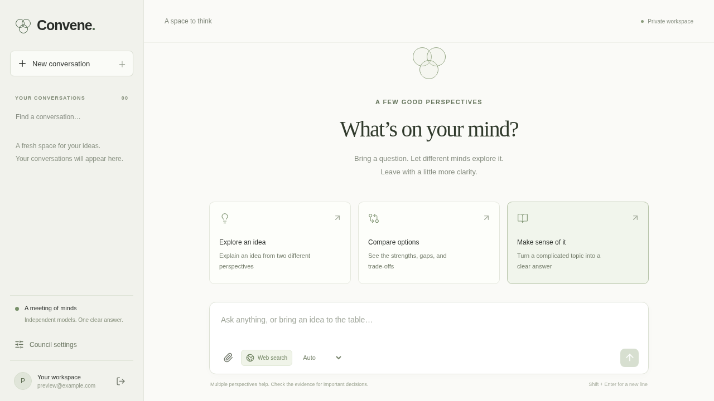

# Convene

A private workspace for asking several models one question, comparing their perspectives, and reading a clear answer with source-linked evidence.



Convene uses a React/TypeScript frontend, a FastAPI backend, and PostgreSQL on Neon. It includes account sign-in, saved conversations, document context, streamed answers, model selection, bounded review rounds, cancellation, feedback, and Markdown export.

## How an answer works

Auto mode chooses a focused answer or a council using a simple routing policy. Council members draft independently, reviewers rank anonymized drafts, and disagreements can trigger revisions before synthesis. The evidence check attaches exact excerpts from retrieved sources or your documents; unsupported claims remain unknown. Model agreement measures agreement, not factual certainty.

The default panel includes GPT-OSS 120B on Groq, Nemotron 3 Super, Nemotron 3.5 Lightning, and OpenRouter's free router. Duplicate underlying models are excluded from voting. Mistral is an optional alternative. Provider failures, token limits, and missing evidence are visible.

See the [end-to-end architecture](docs/enhanced-architecture.md), [deployment guide](docs/deployment.md), and [provider check snapshot](docs/provider-check-2026-09-15.json).

## Run locally

Requires Python 3.12+ and Node 22.12+.

```bash
cp .env.example .env
python3 -m venv .venv
.venv/bin/python -m pip install -e '.[dev]'
# Edit .env: add the provider keys and optionally your Neon DATABASE_URL.
.venv/bin/python -m scripts.init_db
.venv/bin/python -m uvicorn backend.main:app --reload --port 8001
```

In a second terminal:

```bash
cd frontend
npm ci
npm run dev
```

Open http://localhost:5173 and create an account. Vite proxies the API to port 8001. Local development can use SQLite; the hosted app requires PostgreSQL. Never commit .env or put API keys/database credentials in VITE variables.

To import original JSON conversations after creating your account:

```bash
.venv/bin/python -m scripts.import_legacy --email your-account@example.com
```

The importer preserves the source files, skips existing IDs, and does not treat legacy confidence scores as verified evidence.

## Checks

```bash
.venv/bin/python -m pytest -q
cd frontend
npm run lint
npm test
npm run build
npx playwright install chromium
npm run test:e2e
```

Browser tests start their own API with synthetic providers and a temporary database. They do not call paid models or use your Neon data. Set PLAYWRIGHT_CHROME_PATH to use an installed Chrome binary.

## Hosting and limits

The deployment configuration targets Cloudflare Pages, one Render Free web service, and Neon. Accounts own their conversations; an invitation code is mandatory in production. Daily quotas survive chat deletion. Run events and partial results persist in the database.

Use **one backend process and one service instance**. Startup marks unfinished runs interrupted; it does not automatically repeat paid model calls. Concurrent replicas and rolling deployment overlap require a database lease/worker design before scaling. The current schema initializer creates missing tables; future changes to existing columns need versioned migrations.

This is intended for a small invited group. Password reset, email verification, automated retention, and an administrative account-management interface are not implemented. Free model availability and quotas can change. No additional provider key is needed for Nemotron: it shares OpenRouter's key.
