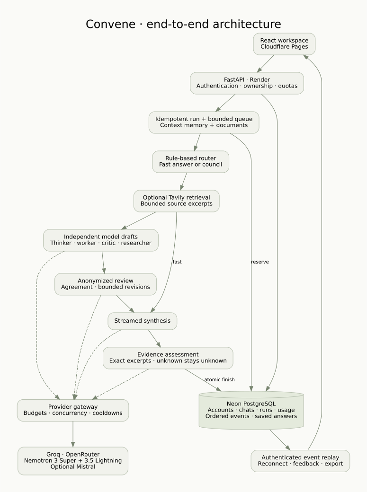
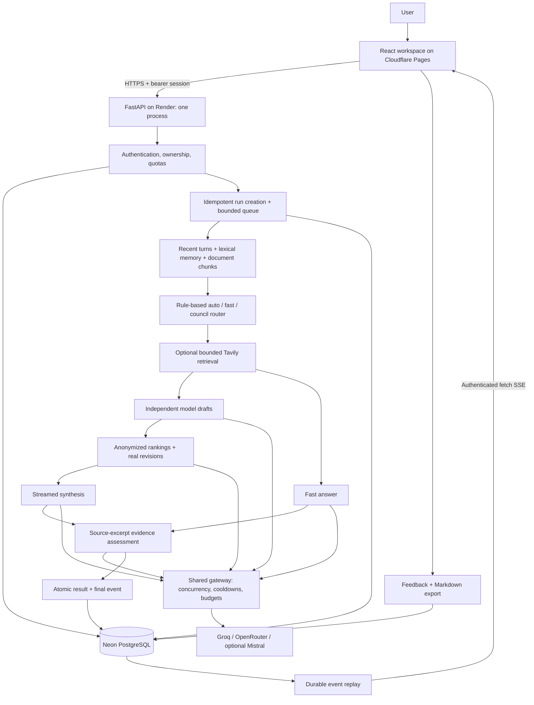

# Convene: implemented end-to-end architecture

## Request lifecycle

1. An authenticated account creates or selects an owned conversation. A unique request key prevents accidental duplicate runs. A transaction reserves the conversation and records daily usage.
2. The run enters a bounded in-process queue. Queue and execution time share one deadline. A token/call budget and provider concurrency limits bound work.
3. Recent conversation turns, relevant older messages, and relevant document chunks form bounded context. Previous documents can be reused for follow-up questions.
4. A transparent rule policy routes to fast or council mode. Optional web retrieval returns source excerpts; unavailable search does not become fabricated evidence.
5. Council members draft independently with complementary roles. Actual provider model identities are recorded and duplicate underlying models are excluded. Two valid independent review ballots can establish ranking agreement; malformed or missing ballots cannot.
6. If reviewers disagree, selected drafts are revised before another bounded review round. A synthesis model streams a readable answer. Fallback is allowed before output begins; an interrupted stream retains its partial answer.
7. An evidence assessor checks important claims against supplied excerpts. A claimed supporting excerpt must actually occur in the identified source. The semantic judgment is still a model assessment, not a guarantee.
8. Completion atomically saves the answer, final status, and final event, and releases the conversation. The browser reconnects by event sequence and can replay missed output. Feedback and export use saved data.

## Storage

| Table | Purpose |
| --- | --- |
| users | Account identity and salted password hash |
| sessions | Hashed session tokens with expiration |
| conversations | Ownership, title, and active-run reservation |
| messages | User turns and saved answers |
| runs | Request, status, result, usage, feedback, idempotency |
| run_events | Ordered, durable progress and answer events |
| usage_entries | Quota accounting independent of chat deletion |

Provider keys remain in backend environment variables. The browser stores a session token in sessionStorage. Every conversation, run, export, and event request checks ownership. Uploads are size-limited; extracted text is bounded and treated as untrusted context. Uploaded source binaries are not retained.

## Fugu inspiration and boundaries

[Sakana Fugu](https://sakana.ai/fugu/) treats the multi-agent system as a model and explores learned coordination. Convene adopts the practical separation of routing, complementary roles, tools, and measurable outcomes. Its router is **rule-based**, with no reinforcement-learning training or Fugu benchmark claim.

Run outcomes, model identity, latency, token usage, ranking agreement, and feedback are available for future evaluation. Reported costs are used only when returned by the provider. Execution tools, learned routing, a benchmark/evaluation pipeline, external task workers, and vector retrieval are future extensions.

The current deployment uses one process. Restart recovery marks saved work interrupted and never silently repeats calls. Add distributed run leases and a durable worker queue before multiple replicas or overlapping rolling deployments; add schema migrations before altering existing database columns.
